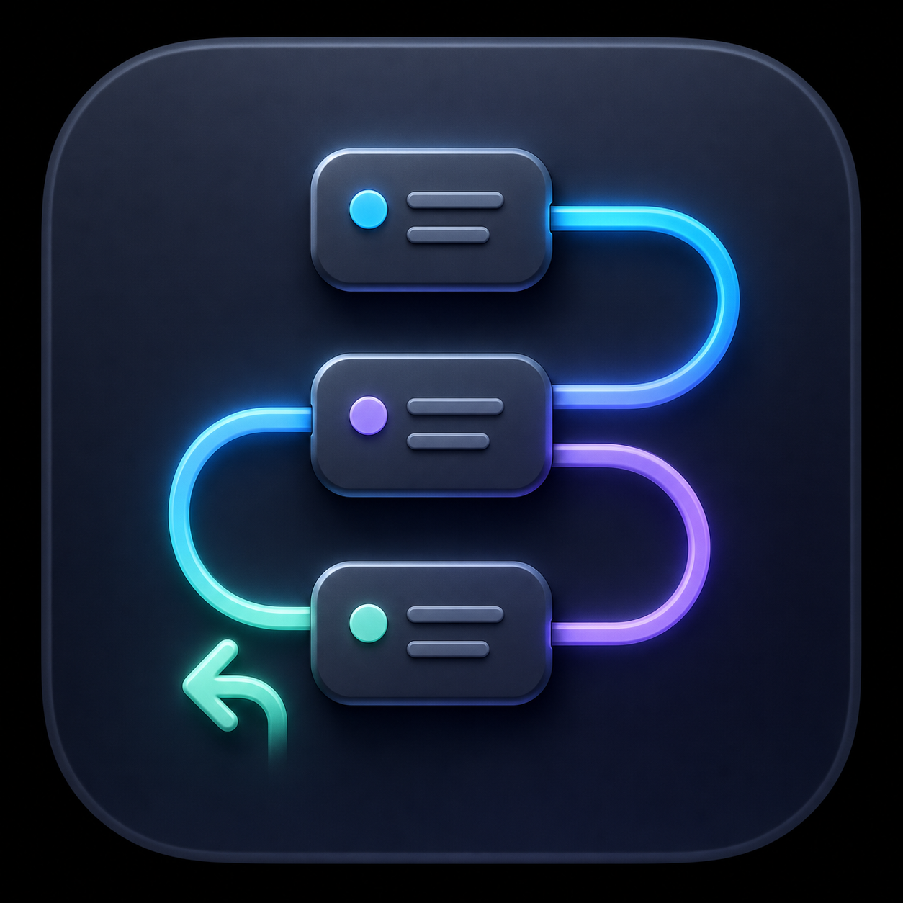
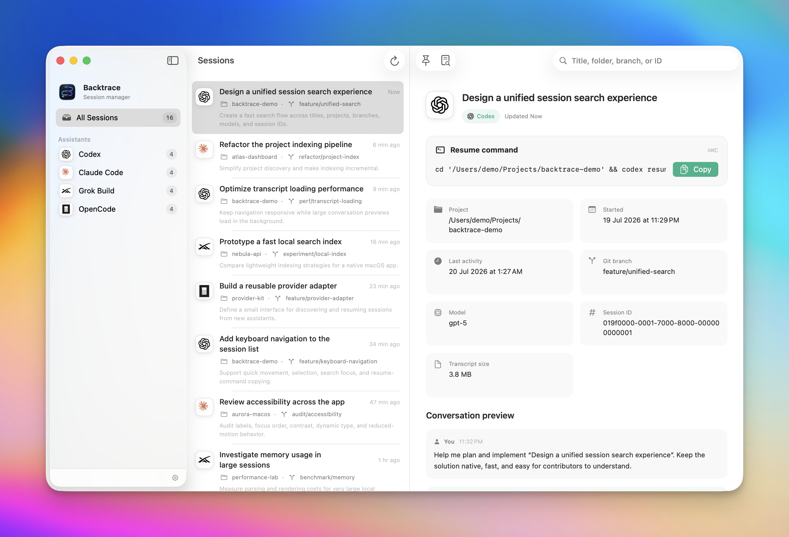

<p align="center">
  
</p>

<h1 align="center">Backtrace</h1>

<p align="center">
  A fast, private macOS session manager for terminal AI coding assistants.
</p>

<p align="center">
  <a href="https://github.com/amrshawqy/backtrace/releases/download/v0.1.4/Backtrace.dmg"><strong>Download for macOS</strong></a>
  ·
  <a href="#build-from-source">Build from source</a>
  ·
  <a href="https://github.com/amrshawqy/backtrace/issues">Report an issue</a>
</p>

<p align="center">
  <a href="https://github.com/amrshawqy/backtrace/actions/workflows/ci.yml"></a>
  
  
  
  <a href="LICENSE"></a>
</p>

<p align="center">
  
</p>

## Download and install

The current release is **Backtrace 0.1.4 (build 6)** for Apple Silicon Macs running macOS 14 or later.

| Download | Use |
| --- | --- |
| [**Backtrace.dmg**](https://github.com/amrshawqy/backtrace/releases/download/v0.1.4/Backtrace.dmg) | Recommended drag-to-install disk image |
| [Backtrace.app](https://github.com/amrshawqy/backtrace/tree/main/dist/Backtrace.app) | App bundle stored in this repository for inspection and reproducibility |

1. Download and open `Backtrace.dmg`.
2. Drag **Backtrace** into the **Applications** shortcut.
3. Eject the disk image and open Backtrace from `/Applications`.

Release checksum:

```text
SHA-256  45ebbe58a506a8d55236021588630c8f344d4b071306b12ab08c5d235724f471  Backtrace.dmg
```

Verify it from Terminal with:

```bash
shasum -a 256 ~/Downloads/Backtrace.dmg
```

### If macOS says Backtrace cannot be verified

The checked-in community build is ad-hoc signed but is not yet Apple-notarized. Gatekeeper may therefore identify it as coming from an unidentified developer.

Only continue if you downloaded Backtrace from this repository and the checksum above matches.

1. Try to open Backtrace once so macOS records the blocked launch.
2. Open **System Settings → Privacy & Security**.
3. Scroll to **Security**, find the Backtrace message, and click **Open Anyway**.
4. Confirm by clicking **Open** and authenticating when prompted.

Apple documents this process in [Open a Mac app from an unknown developer](https://support.apple.com/guide/mac-help/mh40616/mac). Apple also warns that bypassing Gatekeeper for untrusted software is unsafe, so verify the source and checksum first.

If macOS still retains the quarantine flag after you have verified the download, this command removes it from Backtrace only:

```bash
xattr -dr com.apple.quarantine /Applications/Backtrace.app
open /Applications/Backtrace.app
```

Do not run a recursive `xattr` command against `/Applications` or another broad directory.

## Why Backtrace?

Codex, Claude Code, Grok Build, OpenCode, and similar tools make it easy to resume one recent session. They make it much harder to remember which session mattered after several projects and a week of terminal work.

Backtrace turns those scattered local histories into one native browser. Find a session by title, first prompt, project, branch, model, or ID; inspect its useful metadata and conversation preview; then copy the exact project-scoped resume command.

## Features

- Automatically detects supported assistants installed in common locations or available through the login shell.
- Browses Codex, Claude Code, Grok Build, and OpenCode histories in one interface.
- Searches titles, prompts, project folders, Git branches, models, and session IDs.
- Shows project path, started time, last activity, model, transcript size, and available transcript messages.
- Displays full date, time, and timezone details when hovering over a timestamp.
- Copies safely shell-quoted resume commands, including the correct project `cd` when available.
- Pins important sessions and groups sessions by assistant, custom tag, or tracked project folder.
- Adds multiple color-coded tags to any session and filters sessions from the sidebar.
- Supports restricting results to explicitly tracked folders.
- Refreshes on launch, every two minutes while open, and manually with `⌘R`.
- Uses official assistant marks with light and dark appearance support.
- Offers System, Light, and Dark appearance preferences.

Backtrace is intentionally **read-only**. It does not change assistant histories, launch sessions, read credentials, or upload conversation data.

## Supported assistants

| Assistant | Default history location | Resume command |
| --- | --- | --- |
| Codex | `$CODEX_HOME/sessions` or `~/.codex/sessions` | `codex resume <id>` |
| Claude Code | `$CLAUDE_CONFIG_DIR/projects` or `~/.claude/projects` | `claude --resume <id>` |
| Grok Build | `~/.grok/sessions` | `grok --resume <id>` |
| OpenCode | `~/.local/share/opencode` | `opencode --session <id>` |

Archived Codex sessions are read from `$CODEX_HOME/archived_sessions` or `~/.codex/archived_sessions` when present. OpenCode's CLI JSON listing and export commands are used when its older structured session store is unavailable.

Session formats are owned by their respective tools and can change between releases. Backtrace's adapters tolerate missing and newly introduced metadata where practical.

## Keyboard shortcuts

| Shortcut | Action |
| --- | --- |
| `⌘R` | Refresh installed assistants and sessions |
| `⇧⌘C` | Copy the selected session's resume command |

## Privacy and local data

Backtrace works locally:

- Session discovery and parsing happen on the Mac.
- No analytics, telemetry, advertising SDK, account, or cloud service is included.
- Only a bounded conversation preview is kept in memory.
- Pinned session IDs, tags, tracked folders, and the tracked-folder filter are stored in macOS user defaults.
- Copying a resume command writes that command to the system clipboard.

Session transcripts may contain source code, prompts, secrets, or personal information. Do not attach raw histories to public issues. Redact paths, session IDs, credentials, and conversation content before sharing diagnostics.

## Performance and implementation

Backtrace is a native SwiftUI application built with Swift and Foundation only. It has:

- no Electron or browser runtime;
- no third-party package dependencies;
- no background daemon;
- no analytics SDK;
- bounded transcript reads and previews; and
- scanning work performed away from the main actor.

The app detects executables in common user, Homebrew, and application locations, then falls back to resolving commands through the user's `zsh` login shell. Only assistants that are actually installed are shown.

## Build from source

Requirements:

- macOS 14 or later
- Xcode 16 or later with the Swift 6 toolchain
- Apple command-line developer tools

```bash
git clone https://github.com/amrshawqy/backtrace.git
cd backtrace
make test
make app
```

The app is created at `dist/Backtrace.app`. To create the drag-to-install disk image:

```bash
make dmg
```

Build scripts use only tools included with macOS and Xcode. Local output is ad-hoc signed. Shipping a broadly trusted public binary requires a Developer ID Application certificate and Apple notarization.

Useful commands:

```bash
make build   # Debug Swift build
make test    # Deterministic provider and formatter tests
make app     # Release app bundle
make dmg     # Release app plus disk image
make clean   # Remove local Swift and dist output
```

The live-history scanner test is opt-in because local histories may be sensitive:

```bash
BACKTRACE_LIVE_TEST=1 swift test --filter testLiveScannerWhenExplicitlyEnabled
```

## Project structure

```text
Sources/Backtrace/
├── App/                 App entry point and commands
├── Models/              Assistant, session, and navigation types
├── Services/
│   └── Providers/       One history adapter per assistant
├── UI/                  SwiftUI navigation, browser, details, and settings
└── Utilities/           JSONL, dates, strings, and parsing helpers
Tests/BacktraceTests/     Deterministic fixtures and integration tests
packaging/               Info.plist, app artwork, and attributed agent marks
scripts/                 App, icon, and DMG build scripts
dist/                    Checked-in installable release artifacts
```

Adding another assistant normally requires:

1. a case and metadata in `AssistantKind`;
2. executable discovery rules in `InstallationDetector`;
3. a `SessionProvider` adapter for its local store;
4. transcript preview support when the format is readable; and
5. provider fixtures covering parsing and the resume command.

## Troubleshooting

### An installed assistant is not listed

Run the assistant command from a new `zsh` login shell and confirm it resolves to an executable:

```bash
zsh -lc 'whence -p codex claude grok opencode'
```

Backtrace also checks `~/.local/bin`, `~/bin`, `/opt/homebrew/bin`, `/usr/local/bin`, `/usr/bin`, and known assistant-specific locations.

### An assistant appears but has no sessions

- Confirm the CLI has created at least one local session.
- Check the history location in the supported-assistants table.
- If you enabled **Only show sessions in tracked folders**, confirm the session project is inside one of those folders.
- Refresh with `⌘R` after changing CLI configuration.

### A transcript preview is missing

Metadata and resume commands can still work when a provider's transcript contains no readable messages or its on-disk format has changed. Open an issue with a minimal, fully redacted sample structure—never a real private transcript.

## Contributing

Contributions are welcome. Read [CONTRIBUTING.md](CONTRIBUTING.md) before opening a pull request. Please use the issue templates for reproducible bugs and focused feature requests.

Security-sensitive findings should follow [SECURITY.md](SECURITY.md), not a public issue.

Release changes are recorded in [CHANGELOG.md](CHANGELOG.md).

## Brand assets

Assistant names and marks belong to their respective owners and are used only for identification. Sources and attribution notes are recorded in [`packaging/AgentIcons/README.md`](packaging/AgentIcons/README.md). Backtrace is not affiliated with or endorsed by OpenAI, Anthropic, xAI, or the OpenCode project.

## License

Backtrace is available under the [MIT License](LICENSE).
